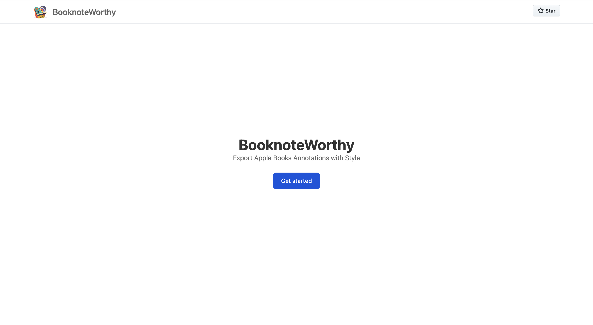
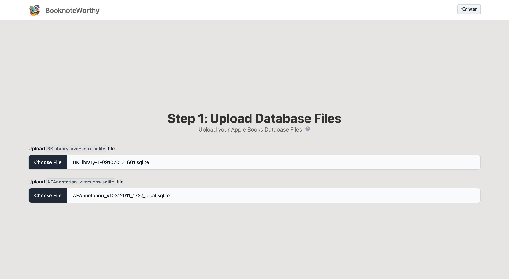
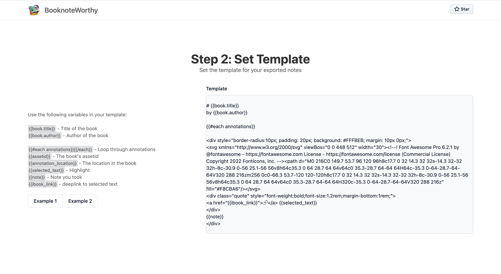
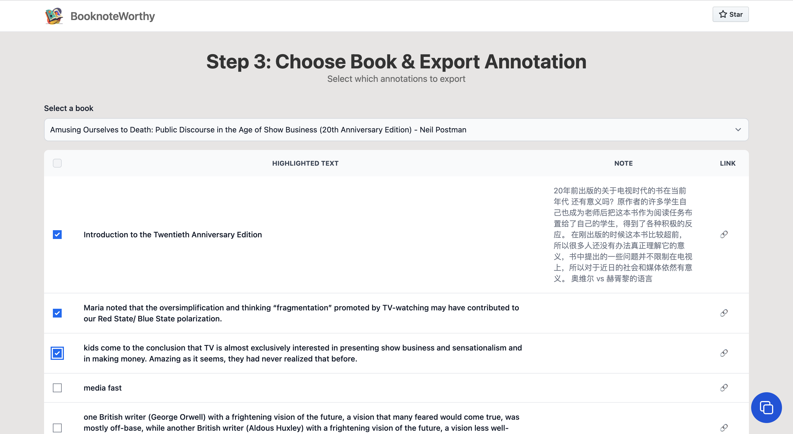
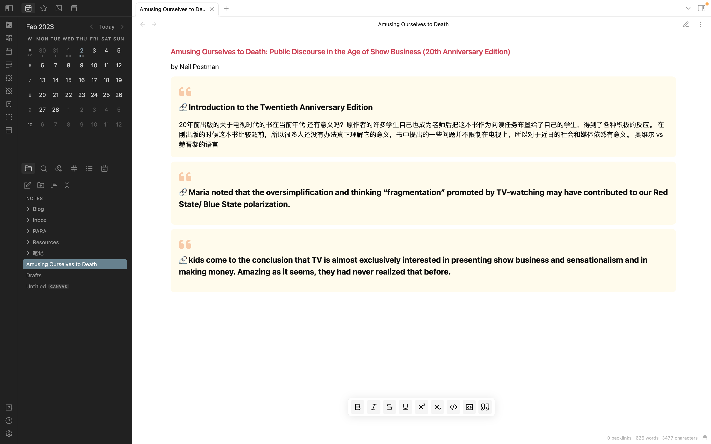

  

# BooknoteWorthy

Style your Apple Book annotations and highlights with custom template, export to your favorite note app with BooknoteWorthy.

## Step 1: Upload Database Files

## Step 2: Set Template

## Step 3: Choose Book & Export Annotation

## Step 4: Paste to your book note

# Developed with

- [Tailwind CSS](https://tailwindcss.com/)
- [Flowbite](https://flowbite.com/)
- [fread-ink/epub-cfi-resolver: A simple parser, resolver and generator for the EPUB-CFI format](https://github.com/fread-ink/epub-cfi-resolver)
